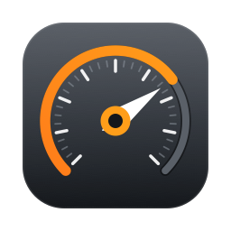

<div align="center">



# Onboard Studio

**Turn your onboard video and lap data into a finished track-day film.**

A native Mac app that lays speedometers, track maps, g-force plots and lap timers
over footage from your camera, driven by the data your logger recorded.

[Download](#download) · [User Guide](docs/user-guide.md) · [What's new](https://github.com/freedenizen/onboardStudio/releases)

</div>

---

> [!WARNING]
> **Onboard Studio is early alpha software.** It is under active development, has not been
> through a public beta, and is not yet at version 1.0. Expect rough edges, changes that
> break older project files, and occasional bugs.
>
> **Keep your original video and data files.** Onboard Studio never modifies them, but
> please do not treat a project file as the only copy of anything you care about.
>
> Bug reports and suggestions are very welcome —
> [open an issue](https://github.com/freedenizen/onboardStudio/issues/new), and attach the file
> **Help ▸ Export Diagnostics…** saves: the app's log, your project's settings and a description of
> its data files, with no videos or data. Nothing is sent anywhere by the app.

## What it does

You come home from a track day with two things: video from a camera, and a data log from a
lap timer or GPS logger. Onboard Studio puts them together.

- **Line the two up.** Onboard Studio can sync your data to your video automatically — from
  the clocks in the files, or, when there are no clocks, by matching the motion in the
  picture to the speed in the log. No counting frames.
- **Drop gauges on top.** Speedometer, tachometer, track map, g-force plot, lap timer,
  bar and line graphs, gear indicator, lap counter and free text. Start from a template
  and move things around, or design a gauge face from scratch.
- **Say what your channels mean, once.** Your logger names things its own way — one car's ABS
  is `canbus:analog_1`. Tell Onboard Studio which column feeds Brake pressure, that it is
  logged in kPa, and that you want it shown in bar, and every file you import afterwards
  follows. Units convert for display; the numbers stay as the file recorded them.
- **Works like a Mac app should.** Every change can be undone, and the Edit menu says what
  Undo will take back. Text and number fields commit when you press Return, and Escape
  abandons them. The attribute window can be driven entirely from the keyboard: ⌥⌘A to open
  it, ⌘F to filter, and Tab through the table in reading order. Every button explains itself
  on hover and to VoiceOver, and **Help ▸ Export Diagnostics…** saves what a bug report needs.
- **Make it yours.** Choose the font, typeface and size of every gauge's text, or one font for
  the whole project. Tell the project which track, car, driver and day it is — most of it fills
  in from the data file — and a title card shows it. Save a layout as your own template, with a
  picture of it in the welcome window.
- **Arrange without fighting it.** Lock finished gauges so a click goes through to the video,
  group a gauge with its label so they move as one, and select several at once. J, K and L
  shuttle, I and O mark a range to export, and a click in the timeline moves the playhead.
- **Cut between cameras.** Put a second camera picture-in-picture, split the screen, or
  switch between angles partway through.
- **Export a finished video.** Up to 4K, including vertical for phones. Upload straight to
  YouTube, or export just the overlays with a transparent background to drop into Final
  Cut or Premiere.
- **Share a lap, not a session.** Export every lap as its own file in one go, leaving out the
  out-lap, the in-lap and the slow ones. Or put the playhead in your best lap and export it as
  a phone-shaped clip, with a card of the day's headline numbers — best lap, top speed, how far
  off the best this lap was — above the picture.
- **See where the time went.** Play two laps side by side — from one session, or today against
  last month — with the second slowed down or sped up so both reach every corner together, and
  the gap between them counting as you go. A lap timer can show what this lap will come to, and a
  graph can plot one channel against another (a G-G diagram, throttle against speed) or show the
  braking point that is still to come.
- **Steady a shaky picture.** Helmet footage shakes. Steady it from the motion data a GoPro records
  with every clip, from the picture's own movement for any other camera, or with Gyroflow if you have
  it installed — and your sync, GPS and telemetry stay exactly as they were.

Everything binds to whatever data you actually loaded — Onboard Studio does not assume your
logger names things a particular way.

### What it reads

**Cameras** — GoPro (including the GPS, accelerometer and gyro recorded inside the video
file), DJI, Sony, Garmin VIRB, and anything else your Mac can play. Fisheye and 360°
footage can be flattened into a normal, pannable view.

**Loggers and apps** — RaceChrono and RaceChrono Pro, RaceRender, Harry's LapTimer,
TrackAddict, Racelogic VBO, Garmin FIT, GPX, TCX, NMEA, DJI `.SRT`, and plain CSV from
almost anything else.

Full details in [docs/formats.md](docs/formats.md).

## Download

**[⬇ Download the latest release](https://github.com/freedenizen/onboardStudio/releases/latest)**

Grab the `OnboardStudio-<version>.dmg`, open it, and drag **Onboard Studio** to your
Applications folder. That's it — the app is signed and notarized by Apple, so it opens with
a normal double-click.

Once installed, it keeps itself up to date: **Onboard Studio ▸ Check for Updates…**

### Requirements

- macOS 15 (Sequoia) or later
- Any Mac from the last several years — Apple Silicon or Intel
- Optional: [ffmpeg](https://ffmpeg.org) (`brew install ffmpeg`), only needed for unusual
  video formats macOS can't open on its own

### Upgrading from OverlayGen

This app used to be called **OverlayGen**. If you have it installed, download the new DMG
and install it once — the automatic updater does not carry across the rename.

Your work comes with you. Existing `.overlayproj` projects, templates and object styles
still open, and your settings and saved templates are migrated the first time Onboard
Studio launches. Projects you save from now on use the new `.onboardproj` extension.

## Getting started

The fastest way in is the sample project — it opens with video, data and overlays already
set up, so you can see how the pieces fit:

**Help ▸ Open the Sample Project**

From there, the [User Guide](docs/user-guide.md) walks through your first overlay in about
five minutes, then covers videos, data, objects, timeline segments and exporting.

If something looks wrong, the guide's
[troubleshooting section](docs/user-guide.md#9-troubleshooting) covers the usual causes.

## What's new

Release notes for every version are on the
[Releases page](https://github.com/freedenizen/onboardStudio/releases), newest first. The
app is at **v0.26.0**; version numbers below 1.0 mean the file format and the interface can
still change between releases.

## For developers

Onboard Studio is written in Swift 6 with SwiftUI and AVFoundation, and is a reimplementation
of the classic RaceRender 3 workflow as a native Mac app. The libraries, tests and the
`onboard` command-line tool build with Swift Package Manager alone:

```sh
swift build
swift test
swift run onboard --help
```

The app bundle is built from an Xcode project generated with
[XcodeGen](https://github.com/yonaskolb/XcodeGen):

```sh
brew install xcodegen
xcodegen generate
open OnboardStudio.xcodeproj
```

Or from the command line — `Scripts/bundle-app.sh` builds `dist/OnboardStudio.app`, and
`Scripts/make-dmg.sh` packages it into a DMG.

A pull request is gated by lint, the package tests, the XCUITest journeys and the commit
signature check. CodeQL's Swift analysis runs on every PR without blocking it, and the slower
checks — coverage, the ffprobe-backed media tests, a headless render and an app bundle — run on
`main` after the merge and nightly, and file an issue when they fail.

Further reading: [CONTRIBUTING.md](CONTRIBUTING.md) to get set up,
[docs/architecture.md](docs/architecture.md) for how it fits together,
[docs/landscape.md](docs/landscape.md) for how it compares with RaceChrono Pro, TrackAddict,
VBOX and AiM, [docs/scripting.md](docs/scripting.md) for overlay objects that draw with
JavaScript, and [docs/project-format.md](docs/project-format.md) for what's inside a project
file.

## License

MIT — see [LICENSE](LICENSE). Third-party components are listed in
[docs/third-party.md](docs/third-party.md).
