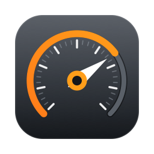
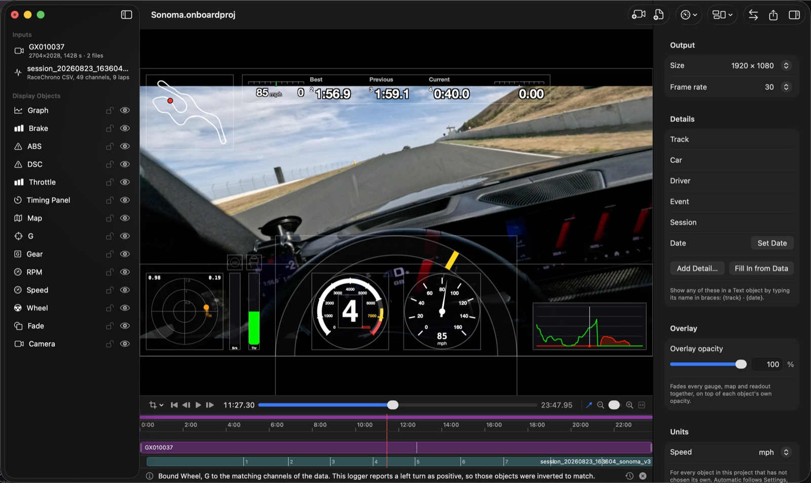
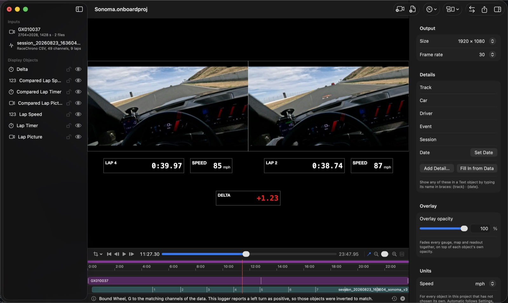
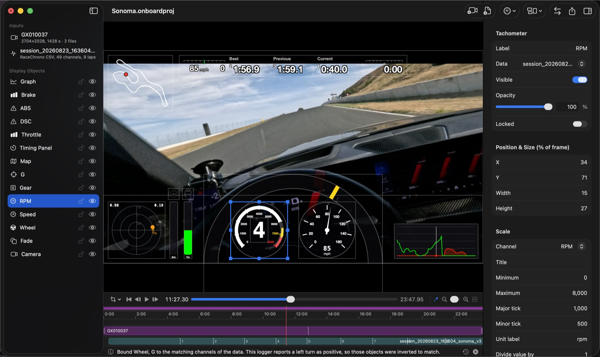
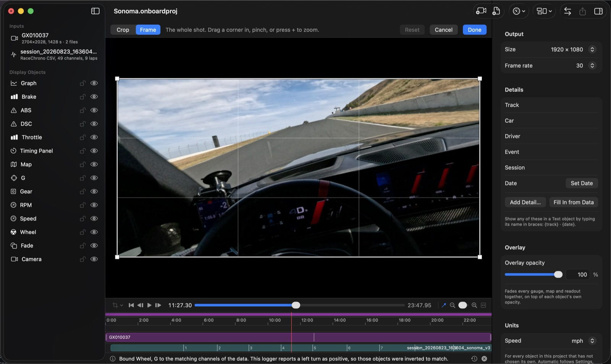
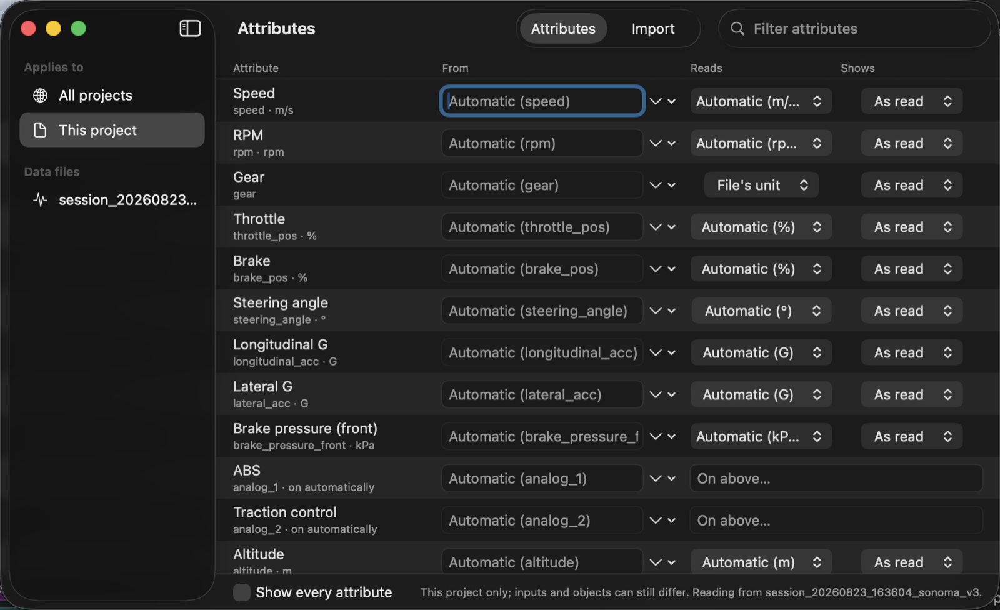

<div align="center">



# Onboard Studio

**Turn your onboard video and lap data into a finished track-day film.**

A native Mac app that lays speedometers, track maps, g-force plots and lap timers over footage
from your camera, driven by the data your logger recorded.

[Download](#download) · [User Guide](docs/user-guide.md) · [What's new](https://github.com/freedenizen/onboardStudio/releases)



</div>

> [!WARNING]
> **Early alpha.** Onboard Studio is not yet at 1.0: expect rough edges and project files that
> may change between versions. It never modifies your video or data files, but keep the originals.
> Found a bug? [Open an issue](https://github.com/freedenizen/onboardStudio/issues/new) and attach
> what **Help ▸ Export Diagnostics…** saves (settings and a description of your files, no media).

## Features

**Sync and data**
- Syncs data to video automatically, from the clocks in the files or, when there are none, by
  matching the picture's motion to the speed in the log; a manual panel nudges by frames.
- Reads GoPro telemetry straight from the video, and logs from RaceChrono, RaceRender, Harry's
  LapTimer, TrackAddict, VBO, FIT, GPX, TCX, NMEA, DJI and plain CSV ([formats](docs/formats.md)).
- Says what your channels mean once: pick the column behind Brake pressure, its unit and the unit
  to show, for all projects or just this one. Nothing assumes how your logger names things.
- Knows 1,290 circuits: start/finish, sectors and corner names are found or placed once per track.

**Overlays**
- Speedometer, tachometer and gauges of your own design, track map, g-force plot, lap and delta
  timers, timing strip, sector times, bars, graphs, digital readouts, gear, lap counter, warning
  lights, steering wheel, stat card, shapes, text and images.
- Six built-in templates — Classic Dash, Glass Cockpit, Cockpit with Graph, Minimal, Data Wall
  and Social (9:16) — and your own, saved from any layout.
- Deltas to your best lap, projected lap time and sector times, with no scripts.
- Fonts, colours and zones on every gauge; JavaScript objects for anything else
  ([scripting](docs/scripting.md)).

**Video**
- Several cameras: picture-in-picture, split screen, or switch angles partway through.
- Crop and frame the picture by eye on the preview; flatten fisheye and 360° footage.
- Steady shaky footage from GoPro motion data, from the picture itself, or with Gyroflow.

**Laps and export**
- Compare two laps side by side, kept level corner by corner, from one session or two.
- Export up to 4K, every lap as its own file, a vertical clip for phones, or the overlays alone on
  a transparent background for Final Cut or Premiere; upload straight to YouTube.

**A Mac app**
- Everything undoable, full keyboard control (J/K/L, I/O, nudging), VoiceOver labels.
- Your project changes only when you save; unsaved edits survive a crash.
- Signed, notarized, and it keeps itself up to date.

## Screenshots

| | |
|---|---|
|  |  |
| **Compare Laps** — two laps level by distance, the gap counting as you go | **Inspector** — every gauge's scale, zones, colours and fonts |
|  |  |
| **Frame Picture** — zoom and position the shot by eye | **Attributes** — what each column means, in which unit |

## Download

**[⬇ Download the latest release](https://github.com/freedenizen/onboardStudio/releases/latest)**
— open `OnboardStudio-<version>.dmg` and drag **Onboard Studio** to Applications. Updates arrive
through **Onboard Studio ▸ Check for Updates…**

- macOS 15 (Sequoia) or later, on Apple Silicon or Intel.
- Optional: [ffmpeg](https://ffmpeg.org) (`brew install ffmpeg`) for video formats macOS cannot
  open itself (MTS, MKV, AVI).
- Upgrading from **OverlayGen**, the app's former name: install the new DMG once. Your
  `.overlayproj` projects, templates and settings carry over.

## Getting started

**Help ▸ Open the Sample Project** opens a project with video, data and overlays already set up.
The [User Guide](docs/user-guide.md) then takes you from your own files to an exported video in
about five minutes, and its [troubleshooting](docs/user-guide.md#9-troubleshooting) section covers
the usual surprises.

## For developers

Swift 6, SwiftUI and AVFoundation. The libraries, tests and the `onboard` command-line tool build
with Swift Package Manager; the app from an [XcodeGen](https://github.com/yonaskolb/XcodeGen)
project:

```sh
swift build && swift test          # libraries and unit tests
swift run onboard --help           # probe, render, sync, upload, bench
xcodegen generate && open OnboardStudio.xcodeproj
```

Start with [CONTRIBUTING.md](CONTRIBUTING.md), then [architecture](docs/architecture.md),
[testing](docs/testing.md), the [project format](docs/project-format.md) and how it compares with
other tools in [landscape](docs/landscape.md). The app is at **v0.28.3**.

## License

MIT — see [LICENSE](LICENSE). Third-party components are listed in
[docs/third-party.md](docs/third-party.md).
